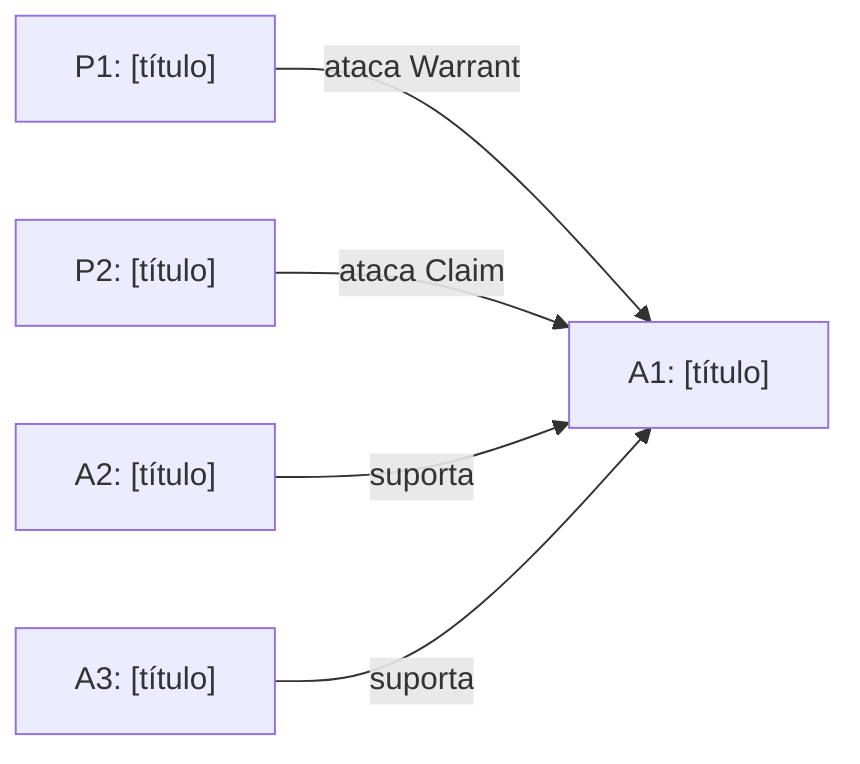

# Fase 2 — Dung Estrutural

## Princípio crítico

**A Fase 2 mapeia ataques. Não marca derrotas.**

Marcar derrotas antes da Fase 3 (Lean) transforma a formalização em ritual
de confirmação: a análise já "sabe" quem venceu antes de verificar se as
premissas compilam. Isso invalida o pipeline.

O grafo desta fase mostra relações de ataque; extensões admissíveis são
calculadas apenas na Fase 5 (Dung resolutivo), após Lean + análise subjetiva.

## Tipos de ataque

| Tipo | O que ataca | Exemplo |
|---|---|---|
| **Ataque à Claim** | A conclusão do pacote diretamente | P1 mostra que a conclusão de A1 não se sustenta |
| **Ataque ao Warrant** | A regra geral que conecta Data à Claim | P2 mostra que o Warrant de A1 tem exceção que torna a regra inaplicável ao caso |
| **Ataque à Data** | Os fatos ou documentos invocados | P3 mostra que os fatos de A1 não correspondem ao caso concreto |
| **Ataque à aplicação Data→Claim** | A passagem dos fatos para a conclusão | P4 mostra que, mesmo com a Data e o Warrant, a Claim não segue |
| **Ataque ao Rebuttal** | A ausência de enfrentamento de exceção | P5 mostra que o Rebuttal de A1 não foi examinado e, se fosse, inverteria a Claim |

## Template de tabela de ataques

| Atacante | Atacado | Tipo | Descrição |
|---|---|---|---|
| P1 | A1 | Warrant | [descrição do ataque] |
| P2 | A1 | Claim | [descrição do ataque] |
| ... | ... | ... | ... |

## Template de diagrama Mermaid (opcional)

## Notas estruturais

- **Concentração de ataques**: Se vários P* atacam o mesmo A*, registrar
  os ângulos distintos separadamente. Ataques sobrepostos serão distinguidos
  na Fase 5.
- **Pacotes instrumentais**: A* sem atacantes diretos que sustentam A1 devem
  ser explicitados no diagrama. Eles "caem por arrasto" se A1 for derrotado
  — mas isso é conclusão da Fase 5, não desta fase.
- **Ausência de Rebuttal**: Se A* não tem Rebuttal na Fase 1, anotar aqui
  como lacuna estrutural. Não inferir derrota ainda.

## Heurística de revisão antes de prosseguir

Antes de passar à Fase 3, confirmar:

- [ ] Toda P* tem pelo menos um A* que ataca?
- [ ] O tipo de ataque de cada linha da tabela é preciso (Warrant vs. Claim vs. Data)?
- [ ] Pacotes A* sem atacantes estão identificados como instrumentais ou autônomos?
- [ ] O diagrama Mermaid corresponde à tabela?

## Output esperado

- Tabela de ataques com colunas: atacante, atacado, tipo, descrição
- Diagrama Mermaid com todos os pacotes e arestas de ataque
- Notas estruturais sobre concentração de ataques, pacotes instrumentais
  e lacunas de Rebuttal

O documento serve de insumo para a Fase 3 (briefing para a LLM-formalizadora).
