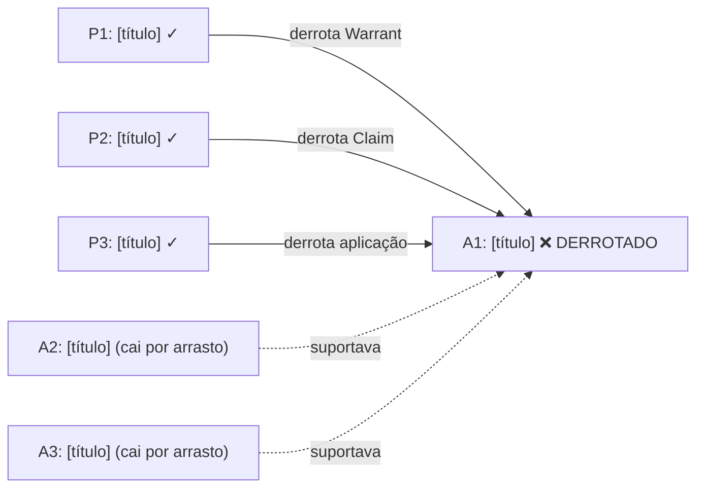

# Fase 5 — Dung Resolutivo

## Princípio crítico

**Toda derrota marcada deve referenciar:**
- **(a)** o teorema Lean que a sustenta formalmente, e
- **(b)** a ficha qualitativa da Fase 4.

Marcação sem (a) é especulação. Marcação sem (b) é Lean tomado como oráculo.
Derrotas válidas requerem ambos.

## Diferença em relação ao Dung estrutural

| Dung estrutural (Fase 2) | Dung resolutivo (Fase 5) |
|---|---|
| Mapeia ataques | Marca derrotas |
| Não decide vencedores | Calcula extensões admissíveis |
| Insumo: Toulmin | Insumo: Lean + análise subjetiva |
| Todo ataque é relevante | Apenas ataques sustentados entram |
| Produz grafo de ataque | Produz grafo de derrotas + síntese |

## Template de tabela de derrotas

| Atacante | Atacado | Teorema Lean | Ref. Fase 4 | Resultado |
|---|---|---|---|---|
| P1 | A1 (Warrant) | `ataque_1_nome` | §2.1 | A1 DERROTADO |
| P2 | A1 (Claim) | `ataque_2_nome` | §2.2 | A1 DERROTADO (confirma) |
| P3 | A1 (aplicação) | `ataque_3_nome` | §2.3 | A1 DERROTADO (confirma) |

Para ataques descartados na Fase 4, incluir linha com resultado "descartado
na Fase 4" e referência à razão (sem teorema Lean na coluna).

## Template de grafo resolutivo Mermaid

Convenção: `❌` para derrotado, `✓` para sobrevivente, `(cai por arrasto)`
para pacote instrumental cujo suporte central foi derrotado. Arestas cheias
para ataques vitoriosos; tracejadas para suporte instrumental.

## Síntese argumentativa

Após a tabela e o grafo, redigir síntese com três componentes:

1. **Pacotes derrotados**: listar A* derrotados e o ângulo principal de cada
   derrota (Warrant / Claim / Data / aplicação / Rebuttal).
2. **Pacotes sobreviventes**: A* sem derrota marcada e a razão (sem atacante,
   ou atacante descartado na Fase 4).
3. **Cobertura conjunta dos P* vitoriosos**: os ataques que sobreviveram são
   suficientes para sustentar o pedido da peça? Há lacunas?

## Tratamento de ataques sem teorema Lean (caminho excepcional)

Se um ataque da Fase 2 foi considerado sólido na Fase 4 mas o teorema Lean
correspondente não compilou (por razão técnica, não por falha dogmática):

- **Não marcar como derrota na tabela principal**
- Incluir nota de rodapé: "ataque P* tem sustentação dogmática sólida
  (Fase 4, §X), mas o teorema Lean não foi concluído — derrota não marcada
  formalmente"
- Avaliar se o caminho informal é suficiente para a Fase 6 ou se requer
  novo ciclo da Fase 3

Este caminho excepcional deve ser raro. Se vários ataques caem aqui, o
problema está nas fases anteriores.

## Heurística de revisão final

Antes de passar à Fase 6, verificar:

- [ ] Toda derrota na tabela tem referência a teorema Lean e a parágrafo da Fase 4?
- [ ] O grafo Mermaid é consistente com a tabela?
- [ ] Pacotes instrumentais que "caem por arrasto" estão identificados como tal
  (não como derrotados diretamente)?
- [ ] A síntese responde: os ataques sobreviventes cobrem o pedido da peça?

## Output esperado

- Tabela de derrotas com referências cruzadas
- Grafo resolutivo Mermaid
- Síntese argumentativa (três componentes)
- Recomendações para a Fase 6: quais ataques liderar, quais subsumir,
  quais suprimir (triviais ou não sustentados)

O documento serve de insumo para a Fase 6 (tradução forense — a peça).
