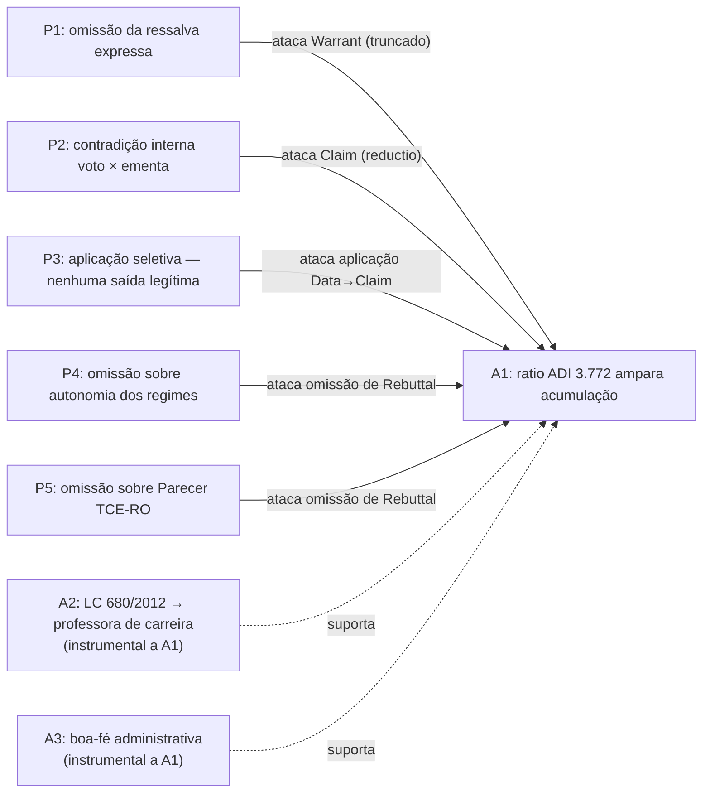

# Fase 2 — Dung Estrutural | Caso M.B. (anonimizado)

> Apelação 7003XXX-XX.2024.8.22.0010 — IPERON × M.B.
> TJRO, 2ª Câmara Especial, 29/04/2026

**Lembrete de fase**: mapear ataques apenas. Nenhuma derrota é marcada aqui.
Extensões admissíveis são calculadas na Fase 5, após Lean + análise subjetiva.

---

## Tabela de ataques

| Atacante | Atacado | Tipo | Descrição |
|---|---|---|---|
| P1 | A1 | Warrant | O Warrant de A1 foi transcrito pelo próprio voto em sua versão completa (com ressalva "excluídos especialistas em educação"), mas aplicado em versão truncada. P1 ataca a versão truncada como inconsistente com o Warrant completo admitido. |
| P2 | A1 | Claim | A transcrição integral da ementa (que inclui a ressalva) e a aplicação sem ressalva geram contradição interna: A1 afirma e nega a mesma proposição. P2 ataca a Claim diretamente via reductio. |
| P3 | A1 | Aplicação Data→Claim | O TJRO invocou a ADI 3.772 sem realizar nenhuma das saídas legítimas de tribunal vinculado a precedente de controle concentrado (art. 927, I, CPC): não aplicou corretamente (não identificou fundamentos determinantes nem demonstrou ajuste), não distinguiu e não superou. P3 ataca a passagem dos fatos (Data) à conclusão (Claim). |
| P4 | A1 | Rebuttal | A ADI 3.772 decidiu no contexto do art. 37, XVI, CF (regime de acumulação). O reenquadramento da LC 680/2012 opera no art. 40, §5º, CF (regime previdenciário). O Rebuttal — autonomia dos regimes constitucionais — não foi examinado. P4 ataca a omissão do Rebuttal. |
| P5 | A1 | Rebuttal | O IPERON invocou o Parecer Prévio TCE-RO PPL-TC 00027/19 como fundamento contrário autônomo. O voto não menciona o parecer. P5 ataca a omissão de fundamento adverso deduzido. |

---

## Diagrama Mermaid

---

## Notas estruturais

**Concentração em A1.** Todos os cinco pacotes P* atacam A1 por ângulos
distintos. Isso é esperado: A1 é o pacote central do acórdão. A concentração
não é problema — cada ataque opera por mecanismo diferente (Warrant, Claim,
aplicação, dois Rebuttals).

**A2 e A3 como pacotes instrumentais.** A2 (conformidade LDB) e A3 (boa-fé)
não têm atacantes diretos nesta fase. São argumentos de suporte que reforçam
A1, mas cuja força depende de A1 prosperar. Se A1 for derrotado na Fase 5,
A2 e A3 perdem relevância para o desfecho (caem por arrasto), mas não são
logicamente derrotados pelo ataque a A1.

**Independência de P4 e P5.** Embora ambos ataquem A1 pelo ângulo de Rebuttal
não examinado, são omissões sobre fundamentos distintos (regime constitucional
vs. parecer do TCE-RO). Devem ser tratados como ataques independentes na Fase 3.

**Sobreposição parcial P1 ↔ P3.** P1 (Warrant truncado) e P3 (aplicação
seletiva do art. 927) descrevem o mesmo fenômeno por dois quadros normativos
diferentes — argumentação interna de Toulmin (P1) e violação de dever
processual (P3). O Lean formalizará os dois separadamente; a Fase 5 determinará
se ambos são necessários na peça ou se um subsume o outro.

---

## Checklist antes da Fase 3

- [x] Toda P* tem pelo menos um A* que ataca?
- [x] O tipo de ataque de cada linha é preciso (Warrant / Claim / aplicação / Rebuttal)?
- [x] A2 e A3 identificados como instrumentais?
- [x] Diagrama Mermaid consistente com a tabela?
