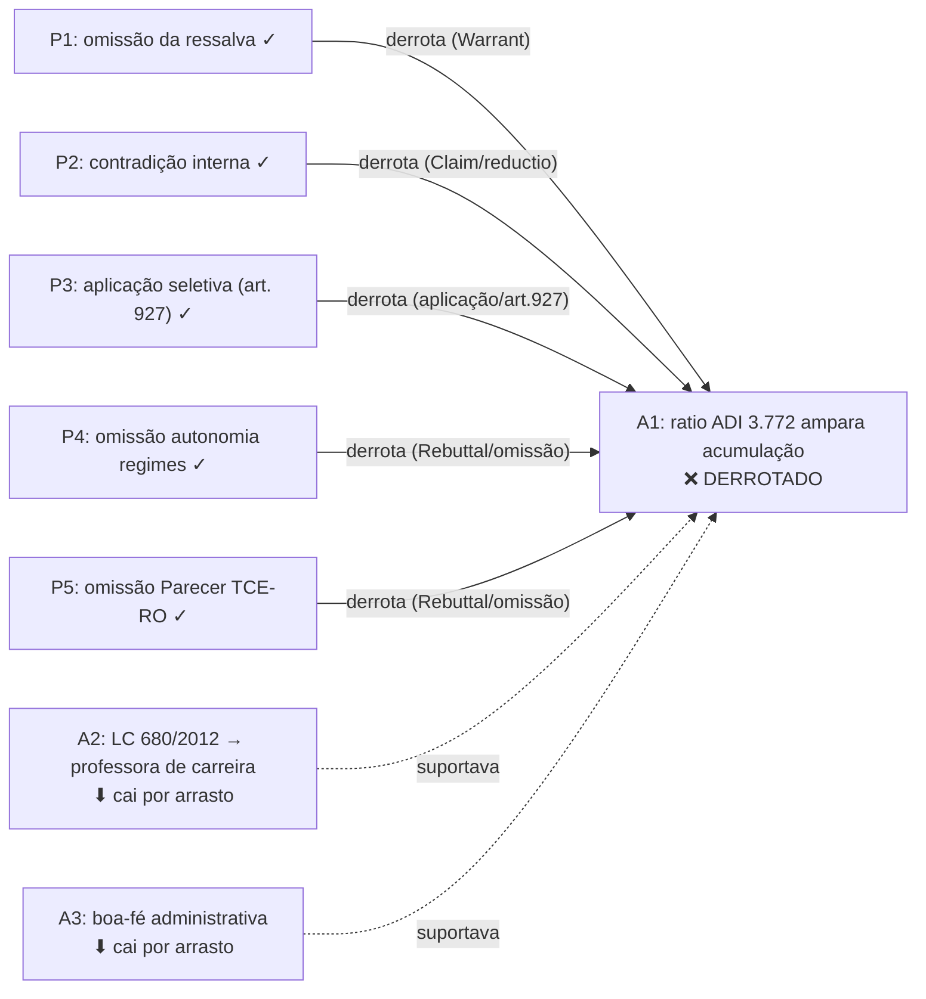

# Fase 4 — Síntese de Derrotas | Caso M.B. (anonimizado)

> Apelação 7003XXX-XX.2024.8.22.0010 — IPERON × M.B.
> TJRO, 2ª Câmara Especial, 29/04/2026

**Lembrete de fase**: toda derrota marcada requer referência cruzada ao
teorema Lean (Fase 2) e à ficha qualitativa da Fase 3. Marcação sem um dos
dois é inválida.

______________________________________________________________________

## Tabela de derrotas

| Atacante | Atacado        | Tipo                              | Teorema Lean                   | Ref. Fase 3 | Resultado                                    |
| -------- | -------------- | --------------------------------- | ------------------------------ | ----------- | -------------------------------------------- |
| P1       | A1 (Warrant)   | Warrant truncado                  | `ataque_1_ressalva_da_ADI`     | §Teorema 1  | **A1 DERROTADO**                             |
| P2       | A1 (Claim)     | Contradição interna               | `ataque_2_contradicao_interna` | §Teorema 2  | **A1 DERROTADO** (confirma, ângulo distinto) |
| P3       | A1 (aplicação) | Nenhuma saída legítima (art. 927) | `ataque_3_aplicacao_seletiva`  | §Teorema 3  | **A1 DERROTADO** (confirma, mais abrangente) |
| P4       | A1 (Rebuttal)  | Omissão de regime constitucional  | `ataque_4_autonomia_regimes`   | §Teorema 4  | **A1 DERROTADO** (ângulo independente)       |
| P5       | A1 (Rebuttal)  | Omissão do Parecer TCE-RO         | `ataque_5_omissao_TCE`         | §Teorema 5  | **A1 DERROTADO** (ângulo independente)       |
| —        | A2             | Instrumental a A1                 | —                              | —           | **Cai por arrasto**                          |
| —        | A3             | Instrumental a A1                 | —                              | —           | **Cai por arrasto**                          |

______________________________________________________________________

## Grafo resolutivo

______________________________________________________________________

## Síntese argumentativa

### Pacotes derrotados

**A1** é derrotado por cinco ataques independentes cobrindo todos os ângulos
identificados no grafo Argdown (Fase 1): Warrant (P1), Claim direta por reductio (P2),
passagem Data→Claim por ausência de saída legítima no art. 927 (P3), e dois
Rebuttals não examinados (P4 e P5). A multiplicidade de derrotas reforça a
robustez do resultado: mesmo que um ataque seja desconsiderado pelo tribunal
de embargos, os demais subsistem independentemente.

**A2** e **A3** caem por arrasto: são argumentos instrumentais cuja
relevância dependia de A1 prosperar. A derrota de A1 não implica que A2 ou
A3 sejam em si mesmos incorretos — implica apenas que perderam a função de
suportar A1 no contexto desta demanda.

### Pacotes sobreviventes (lado do acórdão)

Nenhum pacote do acórdão sobreviveu com ataque sustentado. A1 foi derrotado
em todos os ângulos avaliados; A2 e A3, embora sem atacantes diretos, caem
por dependência de A1.

### Cobertura conjunta dos ataques vitoriosos

Os cinco ataques P\* cobrem integralmente o pedido dos embargos:

- **Omissão** (art. 1.022, I, CPC): P1 (omissão da ressalva), P4 (omissão
  do regime constitucional), P5 (omissão do parecer TCE-RO).
- **Contradição** (art. 1.022, I, CPC): P2 (contradição interna voto × ementa).
- **Ausência de fundamentação** (art. 489, §1º, V e VI; art. 927, §1º):
  P3 (aplicação seletiva sem saída legítima).

A cobertura é suficiente para o provimento dos embargos. Há vício em cada
uma das três hipóteses de cabimento do art. 1.022 que admite enfrentamento
em embargos de declaração (omissão e contradição), mais o vício estrutural
de não-fundamentação pelo art. 489 c/c art. 927.

______________________________________________________________________

## Recomendações para a Fase 5 (tradução forense)

1. **Liderar por P3** (aplicação seletiva, art. 927): é o ataque mais
   abrangente, usa vocabulário processual canônico ("uso impróprio de
   precedente vinculante"; "ausência de aderência aos fundamentos
   determinantes") e subsume parcialmente P1. Não mencionar a arquitetura
   interna do Lean nem o "espaço de saídas".

2. **Seguir com P1 e P2 em conjunto**, apresentados como vícios alternativos
   de omissão e contradição. Abrir diretamente pelo verbo do vício: "o voto
   transcreveu a ementa em sua integralidade — incluindo a ressalva — e
   deixou de aplicá-la ao caso concreto". Não nomear os ataques como P1 e P2.

3. **P4 e P5 como vícios autônomos subsidiários**: apresentar após P1-P3,
   com abertura pelo fundamento adverso omitido ("o recorrente suscitou [X]
   e o voto deixou de se pronunciar").

4. **Teste forense para cada parágrafo**: o parágrafo descreve o que o
   acórdão fez (ou deixou de fazer), não o caminho analítico que levou a
   essa conclusão. Qualquer referência a "leituras", "steelmans", "partição",
   "saídas", "espaço legítimo" ou ao processo de pipeline pertence ao Lean,
   não à peça.
